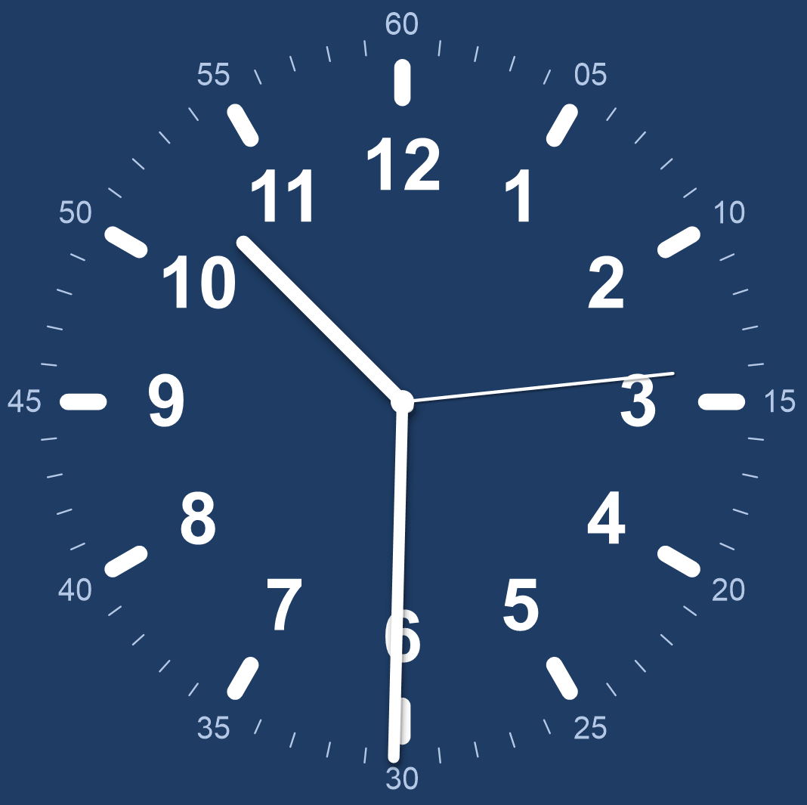
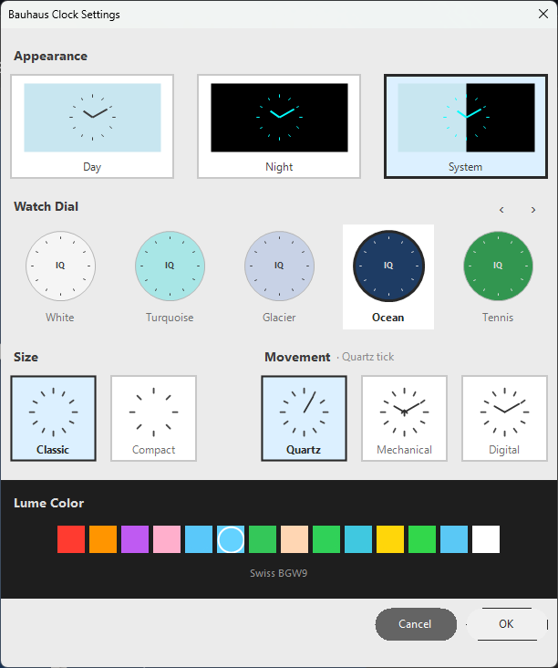

# Bauhaus Clock Screensaver

A Windows screensaver that renders a single, faithful clock face inspired by [bauhausclock.com](https://bauhausclock.com/). The dial is data-driven: 16 colour variants (White, Turquoise, Glacier, Ocean, Tennis, Signal Blue, Sky Blue, Beige, Cream, Lavender, Rose, Salmon, Yellow, Pistachio, Slate, Noir) all share a single renderer — adding a new variant means appending one entry to a catalog, not editing any drawing code.

Built on .NET Framework 4.8 + Windows Forms + GDI+. Single executable, no third-party dependencies.

<p align="center">
  
  
</p>

## Quick start

### Install
1. Build the project (see below) — output is `bin\Release\net48\BauhausScreensaver.scr`.
2. Right-click `BauhausScreensaver.scr` → **Install**. Windows opens the screensaver settings dialog with this screensaver pre-selected.
3. Click **Settings…** in the Windows dialog to configure the dial, appearance mode, movement, and lume colour.

### Build
```powershell
dotnet build -c Release
```
Output:
- `bin\Release\net48\BauhausScreensaver.exe` — for debugging from the IDE
- `bin\Release\net48\BauhausScreensaver.scr` — installable screensaver (produced by the `CopyExeToScr` MSBuild target in the csproj)

Both files are byte-identical; the `.scr` extension is what Windows recognises as a screensaver.

You can also run [`Build.bat`](Build.bat) for a one-click clean+rebuild with extra console output.

### Run directly (without installing)
```powershell
.\bin\Release\net48\BauhausScreensaver.scr /s       # full-screen
.\bin\Release\net48\BauhausScreensaver.scr /c       # configuration dialog
```

## What the screensaver looks like

A single clock face fills the screen, centered, sized to ~80 % of the smaller screen dimension. Layout, from centre outward:

| Element | Radial position (relative to dial radius) | Notes |
|---|---|---|
| Centre hub | 0 | Small filled circle in the hand colour |
| Hour hand | 0 → 0.62 | Capsule, baton shape, ~4 % of radius wide |
| Minute hand | 0 → 0.80 | Capsule, baton, ~3.2 % of radius wide |
| Second hand | 0 → 0.75 | Thin straight line, omitted in Digital movement |
| Hour numerals (1–12) | 0.65 | Bold Arial, ~20 % of radius em-size |
| Pill markers (12 of them) | 0.88 | Rounded capsules, the dominant outer-ring element |
| Tick marks (48 of them) | 0.97 → 1.00 | Short lines between pill markers |
| Minute numerals (05, 10, …, 60) | 1.04 | Regular Arial, ~8.5 % of radius em-size |

All sizes are proportional to the dial radius, so the layout scales correctly from a 200 × 150 preview to a 4K full-screen.

The clock hands cast a multi-pass soft drop shadow to give a sense of lift above the dial face.

## Settings dialog

Launched with `/c` (or from Windows screensaver settings → **Settings…**). A portrait modal with five sections:

1. **Appearance** — Day / Night / System. *Night* forces a black background with all dial elements rendered in the chosen lume colour; *System* switches to Night automatically between 20:00 and 06:00.
2. **Watch Dial** — paginated picker (5 swatches per page, 4 pages). Each swatch shows a miniature dial in the variant's colours. `‹` / `›` navigate pages; the picker opens on the page containing the currently-selected dial.
3. **Size** — Classic (fills 80 % of screen) or Compact (fills 56 %).
4. **Movement** — Quartz tick (1 Hz discrete), Mechanical sweep (6 beats per second), or Smooth sweep (continuous, no second hand drawn). The selected movement is echoed as a subtitle next to the section header, e.g. *Movement · Mechanical sweep*.
5. **Lume Color** — 14-colour palette in a dark band along the bottom. Used as the all-dial-elements colour when Night mode is active. Green (Swiss BGW9) is the conventional default.

Cancel keeps the previous settings; OK persists them.

## Project structure

```
bauhaus_clock/
├── Program.cs                  Entry point. Parses /s /c /p flags, dispatches to host forms.
├── ScreensaverForm.cs          Full-screen + preview host. 30 FPS double-buffered render loop.
├── BauhausClock.cs             The renderer. Draws one themed dial per call.
├── ClockFaceTheme.cs           Theme record + ClockFaceCatalog with all 16 variants.
├── BauhausConfig.cs            XmlSerializer-backed settings. %APPDATA%\BauhausScreensaver\config.xml.
├── BauhausSettingsForm.cs      Settings dialog (the /c UI).
├── BauhausScreensaver.csproj   Project file. Includes the CopyExeToScr post-build target.
├── Build.bat                   Convenience clean+build+rename script.
├── BuildInstructions.txt       Older build guide (kept for reference).
├── PROJECT_SUMMARY.md          Older design notes (kept for reference).
├── QuickStart.txt              Older quickstart (kept for reference).
├── THEME_IMPLEMENTATION.md     Older theme docs (kept for reference).
├── THEME_REFERENCE.md          Older theme reference (kept for reference).
├── INDEX.txt                   Older file index (kept for reference).
├── clock_face/                 Reference PNGs — one per dial variant. Used during design,
│                               not loaded at runtime.
└── screenshots/                Screenshots used during design iteration.
```

Files outside `Program.cs`, `ScreensaverForm.cs`, `BauhausClock.cs`, `ClockFaceTheme.cs`, `BauhausConfig.cs`, `BauhausSettingsForm.cs`, and `BauhausScreensaver.csproj` are documentation or design assets, not part of the build.

## Architecture

### Data flow at runtime

```
Program.Main
  ├── /s  →  ScreensaverForm(screen.Bounds)         one per monitor
  ├── /p  →  ScreensaverForm(previewHandle)         hosted in Windows preview chrome
  └── /c  →  BauhausSettingsForm  →  BauhausConfig.Save  →  %APPDATA%/.../config.xml

ScreensaverForm
  ├── construct
  │     ├── BauhausConfig.Load()                    deserialises XML, defaults if missing
  │     └── BauhausClock(config)
  └── 30 FPS Timer.Tick
        └── clock.Render(buffer.Graphics, ClientRectangle)
              ├── ResolveTheme(now)                 catalog lookup + optional Night override
              ├── DrawTickMarks
              ├── DrawNumbers
              ├── UpdateSecondHand                  branches on MovementType
              ├── DrawHands                         hour, minute, optional second
              └── DrawCenterHub
```

### The `ClockFaceTheme` record

A pure-data class capturing every property a dial variant can override:

```csharp
public sealed class ClockFaceTheme
{
    public string Id { get; }                    // stable internal id (matches enum slug)
    public string DisplayName { get; }           // verbatim screenshot label
    public Color Background { get; }
    public Color PillColor { get; }
    public Color TickColor { get; }
    public Color HourNumeralColor { get; }
    public Color MinuteNumeralColor { get; }
    public Color HandColor { get; }
    public Color CentreHubColor { get; }
    public HandShape Hand { get; }
    public PillStyle Pill { get; }
    public bool IsDark { get; }                  // controls shadow opacity choices

    public ClockFaceTheme AsNight(Color lume);   // runtime override for Night mode
}
```

`HandShape` and `PillStyle` are enums kept as extension points — today every variant uses `HandShape.Baton` and `PillStyle.Rounded`. Adding a new geometry would mean adding an enum value and a new branch in the renderer; adding a new *colour* variant requires neither — just one entry in the catalog.

### The catalog

`ClockFaceCatalog.All` is an `IReadOnlyList<ClockFaceTheme>` declared in the same order as `BauhausConfig.ClockDialTheme`, so `ClockFaceCatalog.All[(int)dialTheme]` is the lookup. There are no `switch` statements over the enum in the renderer — only this single indexed access.

### Night mode

`BauhausClock.ResolveTheme` returns `baseTheme.AsNight(config.LumeColor)` when the appearance mode is Night (or System after 20:00 / before 06:00). `AsNight` produces a new `ClockFaceTheme` with a near-black background and every visible element re-coloured to the lume colour — preserving the dial geometry, swapping only colours.

### Movement modes

`BauhausClock.UpdateSecondHand` is the only place that branches on movement:

- **Quartz** — `currentSecondAngle = now.Second * 6f` (1 Hz step)
- **Mechanical** — quantised to 6 beats per second (`Math.Floor(seconds * 6) / 6 * 6°`), simulating an escapement
- **Digital** — `(now.Second + now.Millisecond / 1000f) * 6f` (smooth continuous sweep). In this mode the second hand is *not* drawn — only the minute and hour sweep silently.

### Persistence

`BauhausConfig` uses `System.Xml.Serialization.XmlSerializer` against the public properties. The file lives at `%APPDATA%\BauhausScreensaver\config.xml`. Defaults are returned on first launch and on any load error (corrupt XML, missing file, etc.). Saved by the OK button in the settings dialog only — Cancel discards changes.

### Settings dialog layout

The dialog is a 610 × 700 portrait modal at 30 px form padding, divided into five vertically-stacked sections, with the Lume Color section as a full-width dark band along the bottom. The Watch Dial picker uses pagination (5 per page) to keep individual swatches large enough to read; the page automatically flips to whichever page contains the user's saved theme on open.

All four selection states (Appearance, Watch Dial, Size, Movement) use the same dark neutral selection colour (`rgb(40, 40, 40)`) for consistency.

## Command-line arguments

Standard Windows screensaver convention:

| Argument | Behaviour |
|---|---|
| `/s` (or none) | Run full-screen on every connected monitor. `ScreensaverForm` is created once per `Screen.AllScreens` entry. |
| `/c` | Show the settings dialog (`BauhausSettingsForm`). |
| `/p <handle>` | Render into the provided HWND, used by the Windows control panel for the live mini-preview pane. The form re-parents itself to the supplied handle and sets the `WS_CHILD` style. |
| `/c:<handle>` | Variant of `/c` used by some Windows versions — handled by the same code path. |

Exit conditions in full-screen mode: mouse movement above the 5 px threshold, any mouse click, or any key press. Preview mode never exits on its own — the parent window closes the host.

## Adding a new dial variant

1. Add an enum entry in [`BauhausConfig.cs`](BauhausConfig.cs) (`ClockDialTheme`).
2. Add a `new ClockFaceTheme(...)` entry to `ClockFaceCatalog.All` in [`ClockFaceTheme.cs`](ClockFaceTheme.cs), in the same order as the enum. Fill in the eight colour properties and the `isDark` flag.
3. Done. The renderer picks it up; the settings dialog auto-discovers it (the swatch grid is sized from `ClockFaceCatalog.All.Count`, paginated automatically).

No `switch` statement, no paint handler, and no settings-form code needs to change for a colour-only variant.

To add a new *shape* (e.g. a sword hand or rectangular pip), extend the `HandShape` or `PillStyle` enum, then add a branch in the relevant draw method in [`BauhausClock.cs`](BauhausClock.cs).

## Requirements

- Windows 10 or 11
- .NET Framework 4.8 (preinstalled on Windows 10 1903+ and all Windows 11)
- .NET SDK to build (any version that can target net48 — .NET 6+ SDK is fine; the SDK is *only* needed for building, not running)

## Performance

- 30 FPS render loop using a `System.Windows.Forms.Timer` (UI-thread, no separate render thread).
- Double-buffered via `BufferedGraphicsManager.Current` — no flicker.
- Anti-aliased GDI+ (`SmoothingMode.AntiAlias`, `TextRenderingHint.AntiAlias`).
- All Pens, Brushes, Fonts, and GraphicsPaths are created inside `using` blocks, so no GDI handle leaks.
- Hand drop shadow uses four pen passes (capsule outlines); roughly 12 additional `DrawLine` calls per frame.

Typical resource use on a 1920 × 1080 screen: ~3–5 % of one CPU core, 20–30 MB RAM, negligible GPU.

## Troubleshooting

**Screensaver won't install** — the file extension must be `.scr`, not `.exe`. The build target produces both; right-click the `.scr`. If Windows says it's not a valid screensaver, the most common cause is .NET Framework 4.8 not being installed.

**Settings open but the dial picker is empty / clipped** — only happens after editing form-layout constants. The dial-row centering uses `ContentWidth`, derived from `FormWidth - LeftPad - RightPad`. If you change those constants, the dial row recentres automatically; if you change `DialButtonWidth` or `DialsPerPage`, make sure `5 × width + 4 × gap` still fits inside `ContentWidth`.

**Black screen in full-screen mode** — usually means Night mode is on with a lume colour that's also black, or extremely close to black. Open settings, switch Appearance to Day, or pick a non-black lume colour.

**Settings don't persist** — check write permissions to `%APPDATA%\BauhausScreensaver\`. Delete `config.xml` to reset to defaults on next launch.

**File locked during build** (`Unable to delete file ... BauhausScreensaver.scr. Access to the path ... is denied`) — a previously-launched instance is still running. Close any open Bauhaus Clock preview, settings dialog, or full-screen test, or run `Get-Process BauhausScreensaver | Stop-Process` and rebuild.

## Defaults (factory reset)

If `config.xml` is missing or corrupt, the defaults are:

| Setting | Default |
|---|---|
| Appearance | Day |
| Watch Dial | White |
| Size | Classic |
| Movement | Mechanical |
| Lume colour | White |

## Credits

Inspired by [bauhausclock.com](https://bauhausclock.com/) — the dial layouts, colour palette, and variant naming were modelled on that web clock.

Implementation: C# 7.3, .NET Framework 4.8, Windows Forms, GDI+. No third-party packages.
